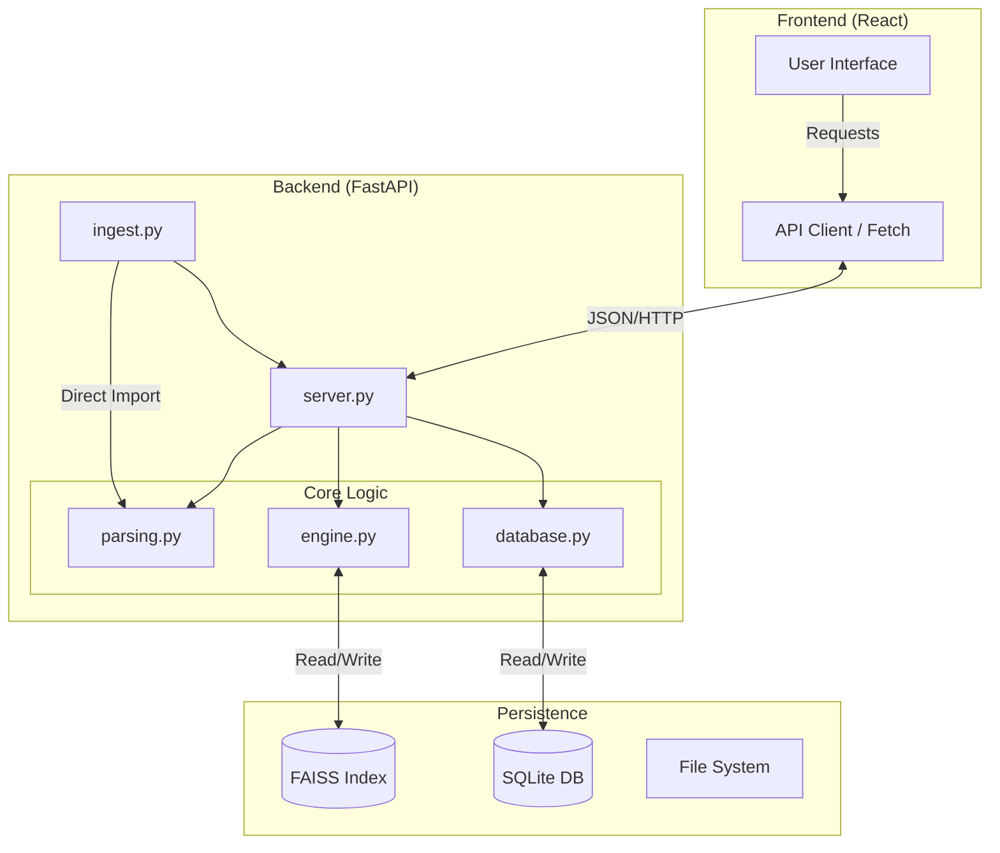
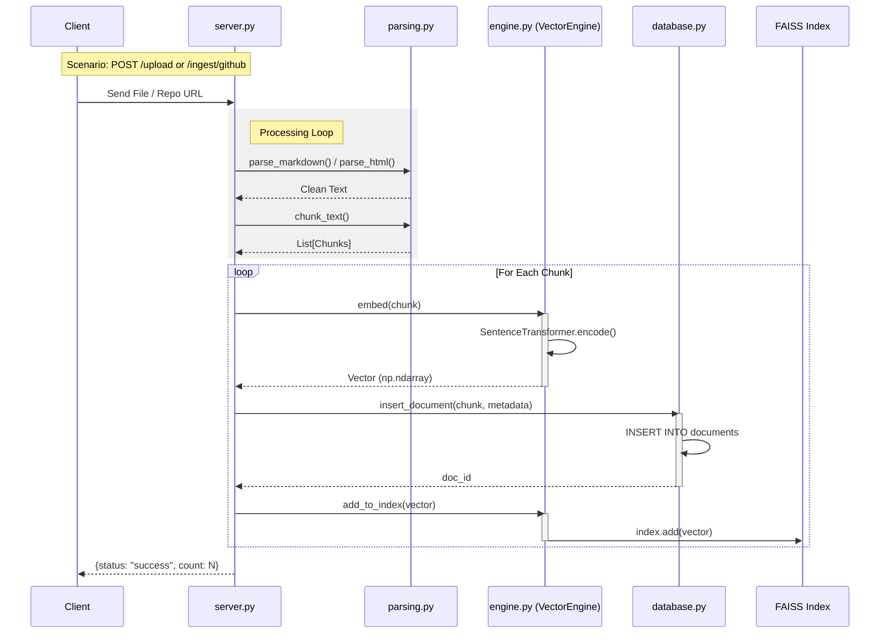
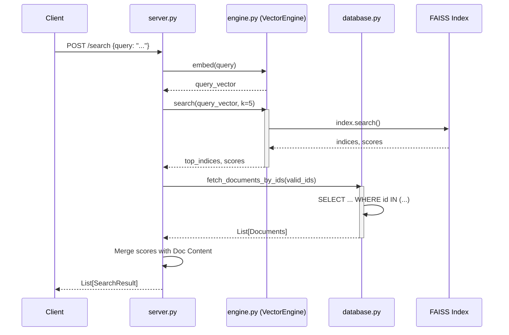
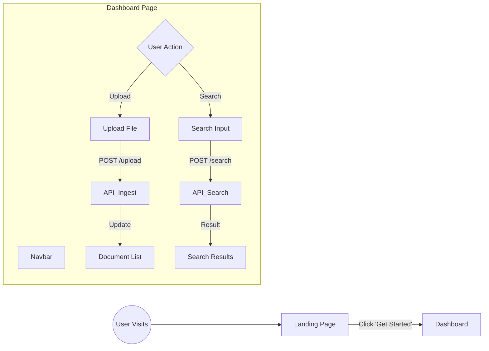

# Module Flow Documentation

This document visualizes the control flow and architecture of the docSeek system using Mermaid diagrams.

## 1. System Architecture Overview

High-level interaction between Frontend, Backend API, Vector Engine, and Persistence layers.

## 2. Ingestion Workflow (Sequence Diagram)

This flow details how a file (uploaded or from GitHub) is processed, chunked, embedded, and stored.

## 3. Search Workflow (Sequence Diagram)

This flow illustrates how a user query is transformed into a vector and used to retrieve semantic matches.

## 4. Frontend Component Flow

Visualizes the user journey within the React application.

