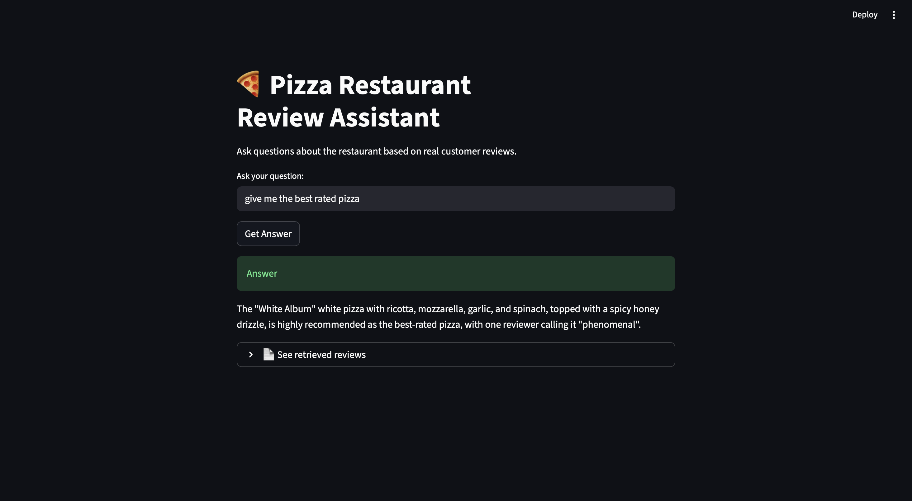

# 🍕 Local AI RAG System for Restaurant Reviews

## 📌 Project Overview

This project is a **Retrieval-Augmented Generation (RAG)** system built using **LangChain, Ollama, and a Vector Database (Chroma)**, with a **GUI built using Streamlit**.

It allows users to ask natural-language questions about a pizza restaurant, and the system answers **based on real customer reviews**, not guesses.

The project demonstrates how **Large Language Models (LLMs)** can be combined with **vector similarity search** to produce **accurate, context-aware answers**.

This is a **local, offline AI system** — no paid APIs or cloud services are required.

---

## 🎯 Key Objectives

- Convert restaurant reviews into vector embeddings  
- Store embeddings in a vector database  
- Retrieve relevant reviews using semantic similarity  
- Inject retrieved content into an LLM prompt  
- Generate accurate answers using a local LLM (Ollama)  
- Provide a **user-friendly GUI** for interaction  

---

## 🧠 Core Concepts Used

- Large Language Models (LLMs)  
- Text Embeddings  
- Vector Databases  
- Semantic Search  
- Retrieval-Augmented Generation (RAG)  
- Prompt Engineering  
- Local AI Inference  
- GUI-based AI Applications  
- Modular Code Design  

---

## 🏗️ Project Architecture

CSV Reviews
↓
Text Embeddings (Ollama Embeddings)
↓
Vector Database (Chroma)
↓
Retriever (Semantic Search)
↓
Prompt Template (LangChain)
↓
Ollama LLM (llama3.2)
↓
Streamlit GUI / CLI
↓
Final Answer


---

## 📁 Project Structure

LOCAL_AI_AGENT_RAG_VECTOR/
│
├── main.py # CLI-based application
├── app.py # Streamlit GUI application
├── vector.py # Vector DB & retriever logic
├── realistic_restaurant_reviews.csv
├── chroma_langchain_db/
├── requirements.txt
├── venv/
└── README.md


---

## 📄 File Explanations

### 🔹 `vector.py` – Vector Database Setup

**Responsibilities:**
- Reads restaurant reviews from a CSV file  
- Converts text into vector embeddings using Ollama  
- Stores embeddings in a Chroma vector database  
- Creates a retriever for semantic search  

**Key concepts:**
- Data ingestion  
- Embedding generation  
- Vector storage  
- Retrieval logic  

---

### 🔹 `main.py` – CLI-Based RAG Pipeline

**Responsibilities:**
- Accepts user questions via the terminal  
- Retrieves relevant reviews from the vector database  
- Injects retrieved content into a prompt template  
- Uses Ollama LLM to generate answers  
- Runs in a continuous interactive loop  

**Purpose:**  
Provides a simple command-line interface to test and understand the RAG pipeline.

---

### 🔹 `app.py` – Streamlit GUI Application

**Responsibilities:**
- Provides a graphical user interface (GUI)  
- Accepts user questions through a text input  
- Displays AI-generated answers clearly  
- Shows the retrieved reviews used to generate the answer  

**Purpose:**  
Demonstrates how a RAG-based AI system can be exposed through a **modern, user-friendly interface** suitable for demos and portfolio projects.

---

## 🧪 How the System Works (Step-by-Step)

1. Restaurant reviews are loaded from a CSV file  
2. Each review is converted into a vector embedding  
3. Embeddings are stored in a persistent vector database  
4. The user asks a question (CLI or GUI)  
5. The question is embedded and compared with stored vectors  
6. The most relevant reviews are retrieved  
7. Retrieved reviews are injected into a prompt  
8. Ollama LLM generates an answer based on those reviews  
9. The answer (and supporting reviews) is displayed to the user  

---

## ⚙️ Technologies Used

| Technology | Purpose |
|---------|--------|
| Python 3.11 | Core programming language |
| LangChain | LLM orchestration & prompt handling |
| Ollama | Local LLM & embedding generation |
| Chroma | Vector database |
| Streamlit | GUI / Frontend |
| Pandas | CSV data processing |
| Virtual Environment | Dependency isolation |

---

## 🚀 Setup Instructions

### 1️⃣ Create and activate virtual environment

```bash
python3 -m venv venv
source venv/bin/activate


---

## 📄 File Explanations

### 🔹 `vector.py` – Vector Database Setup

**Responsibilities:**
- Reads restaurant reviews from a CSV file  
- Converts text into vector embeddings using Ollama  
- Stores embeddings in a Chroma vector database  
- Creates a retriever for semantic search  

**Key concepts:**
- Data ingestion  
- Embedding generation  
- Vector storage  
- Retrieval logic  

---

### 🔹 `main.py` – CLI-Based RAG Pipeline

**Responsibilities:**
- Accepts user questions via the terminal  
- Retrieves relevant reviews from the vector database  
- Injects retrieved content into a prompt template  
- Uses Ollama LLM to generate answers  
- Runs in a continuous interactive loop  

**Purpose:**  
Provides a simple command-line interface to test and understand the RAG pipeline.

---

### 🔹 `app.py` – Streamlit GUI Application

**Responsibilities:**
- Provides a graphical user interface (GUI)  
- Accepts user questions through a text input  
- Displays AI-generated answers clearly  
- Shows the retrieved reviews used to generate the answer  

**Purpose:**  
Demonstrates how a RAG-based AI system can be exposed through a **modern, user-friendly interface** suitable for demos and portfolio projects.

---

## 🧪 How the System Works (Step-by-Step)

1. Restaurant reviews are loaded from a CSV file  
2. Each review is converted into a vector embedding  
3. Embeddings are stored in a persistent vector database  
4. The user asks a question (CLI or GUI)  
5. The question is embedded and compared with stored vectors  
6. The most relevant reviews are retrieved  
7. Retrieved reviews are injected into a prompt  
8. Ollama LLM generates an answer based on those reviews  
9. The answer (and supporting reviews) is displayed to the user  

---

## ⚙️ Technologies Used

| Technology | Purpose |
|---------|--------|
| Python 3.11 | Core programming language |
| LangChain | LLM orchestration & prompt handling |
| Ollama | Local LLM & embedding generation |
| Chroma | Vector database |
| Streamlit | GUI / Frontend |
| Pandas | CSV data processing |
| Virtual Environment | Dependency isolation |

---

## 🚀 Setup Instructions

### 1️⃣ Create and activate virtual environment

```bash
python3 -m venv venv
source venv/bin/activate

The "White Album" white pizza with ricotta, mozzarella, garlic, and spinach,
topped with a spicy honey drizzle, is highly recommended as the best-rated pizza.

🧠 Learning Outcomes
Understood how vector databases enable semantic search
Learned how embeddings represent semantic meaning
Implemented RAG to reduce LLM hallucinations
Built a complete local AI system with GUI
Integrated backend AI logic with frontend interfaces

## 🖥️ Application Preview (GUI)

### Main Interface


### Retrieved Reviews


